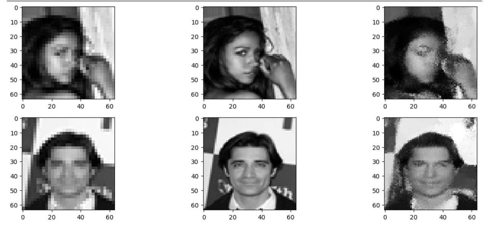
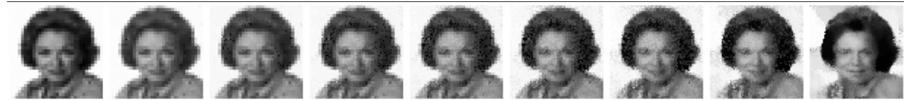

# Discrete Flow Matching for Image Super Resolution

This GitHub is dedicated to implementing the Discrete Flow Matching method for Image to image resolution enhancement of images. In this repository the model for CelebA Dataset is implemented. 


<p align="center">
  
</p>
<p align="center">
  <em>Downscale image - left, True image - center, Sampled image  right
</em>
</p>

<p align="center">
  
</p>
<p align="center">
  <em>Plot of sampling the photo from t=0 to t=1 with 7 between steps, here you can see the flow from x_0 to x_1_pred of model </em>
</p>


# User Guide

## Quick Start

All necessary dependencies are in file [requirements.txt](requirements.txt) Make the environment (pipenv or conda):\
`pip`:

```bash
$ python -m venv your_env
$ source your_env/bin/activate
```

`conda`:

```bash
$ conda create -n your_env
$ conda activate your_env
```

Then, install the requirements:

```bash
$ pip install -r requirements.txt
```

To check:

```bash
$ pip freeze
```

or

```bash
$ conda list
```

# Authors
* [Egor Miroshnichenko](https://github.com/Chenkomirosh)

# References
* [G. Itai, R. Tall et al. Discrete Flow Matching. NeurIPS, 2024](https://arxiv.org/pdf/2407.15595
)
* [A. Campbell, J. Yim et al. Generative Flows on Discrete State-Spaces: Enabling Multimodal Flows with Applications to Protein Co-Design. ICLR, 2024](https://arxiv.org/pdf/2402.04997
). 
* [Y. Lipman, M. Havasi et al. Flow Matching Guide and Code. 2024](https://arxiv.org/pdf/2412.06264)

